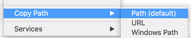
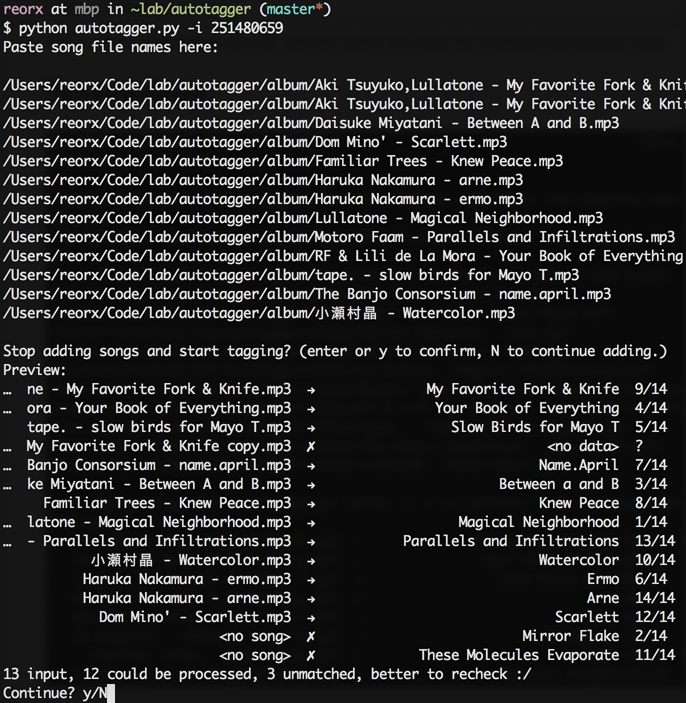
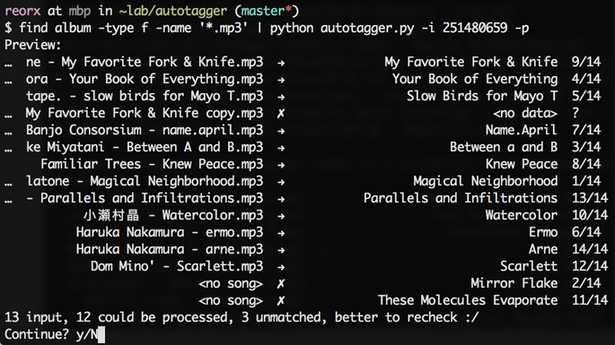

Autotagger
==========

Tag ``.mp3`` and ``.m4a`` audio files from iTunes data automatically.

There are various standards in audio file tagging, and the fields they contain
are huge mess, but since most of them are not being used by us normal people,
to make things simpler, I chose 8 essential and common fields pragmatically:

- Title
- Album
- Artist
- Album Artist
- Genre
- Release Date
- Track Number
- Disc Number

By default, autotagger will only work with these 8 fields, anything not included will be
ignored.

autotagger is currently tested under Mac OS X with Python 2.7.10, if you find anything wrong
with this program, feel free to submit an issue.

TODO:

- [ ] append album artwork in tracks

Installation
------------

::

    pip install autotagger

Usage
-----

autotagger combines audio files with iTunes data,
it uses track number (and disc number, if exists) to identify a song and
match it with iTunes data. In short, the progress could be summarized in three steps:

- Find the url of your album on iTunes, for `example
  <https://itunes.apple.com/us/album/note-seconds-schole-compilation/id376201016>`_.
- Make sure every song you want to tag has track number (and disc number,
  if its a multi-CD album) set properly. You can use a ID3 tagging tool like
  `meta <https://itunes.apple.com/us/app/meta-music-tag-editor-audio/id558317092?mt=12>`_
  on OS X or `mp3tag <http://www.mp3tag.de/en/>`_ on Windows to achieve that.
- Run ``autotagger`` command with data above.

``autotagger --help`` to see detailed information about command line options.

Input/Paste songs manually
~~~~~~~~~~~~~~~~~~~~~~~~~~

Use ``-u`` to indicate the iTunes album url:

::

    autotagger -u https://itunes.apple.com/us/album/schole-compilation-vol.-1/id251480659

After running this command, autotagger will ask you to enter the file paths,
you can copy them by right click on songs in finder and choose ``Copy Path``

Then paste them in the terminal, and hit enter to continue.

You can also album id instead of url to make it clearer:

::

    autotagger -i 251480659

Pass songs from pipeline
~~~~~~~~~~~~~~~~~~~~~~~~

If you can get the song names from other command's output, you can use
pipeline mode to feed the input, add ``-p`` option to enable this feature:

::

    find album -type f -name '*.mp3' | autotagger -i 251480659 -p

Clear other tags
~~~~~~~~~~~~~~~~

If you want the songs to be tagged just the 8 fields other than anything else,
add ``-c`` to enable that. By adding this option, only the 8 fields
will be contained in the processed songs, any other fields will be removed.

::

    autotagger -i 251480659 -c

Download artwork
~~~~~~~~~~~~~~~~

Add ``-a`` option to download artwork, note this option will make the command stop tagging songs.

::

    autotagger -i 251480659 -a

Screenshots
-----------

``autotagger -i 251480659``

``find album -type f -name '*.mp3' | autotagger -i 251480659 -p``

